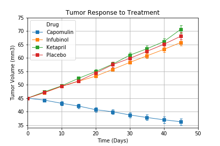
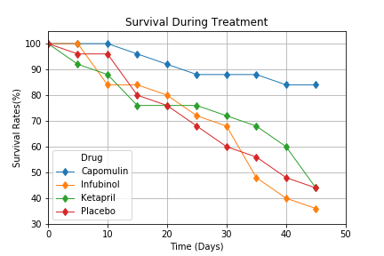
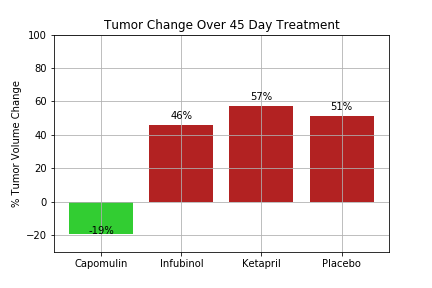

# Pymaceuticals - Data Analysis Using Matplotlib

This repository contains a .ipynb file analyzing data from a fictional pharmaceutical company (Pymaceuticals Inc).  The data was loaded into the jupyter notebook using the pandas Python library.

In this study, 250 mice were treated through a variety of drug regimens over a 45 day treatment period. I analyzed the impact of four treatments (Capomulin, Infubinol, Ketapril and Placebo) on tumor growth, metastasis and survival rates
All the results and conclusions are summarized below.

The efficacy of Capomulin was further demonstrated in the mean metastatic site data shown in Metastatic Spread During Treatment. While new metastatic sites were seen across all regimens, treatment with Capomulin slowed the formation of metastatic sites to an average of 1.5 new sites versus the other treatments. Infubinol 2.1 new sites, Ketapril 3.3 new sites and Placebo 3.4 new sites over the course of the 45-day treatment period.

The survival rates over the 45 day treatment period were plotted in Figure 3, Survival During Treatment. At the end of the drug treatment regimens, the highest overall survival rate was seen with Capomulin (84%). Ketapril, Infubinol and Placebo all displayed significantly lower survival rates at the end of the treatment period, with rates of 44, 36 and 44% respectively.
In sum, the drug Capomulin showed the most promise in treating SCC, because it showed efficacy in reducing tumor size, slowed the formation of metastatic sites and had the highest overall survival rate.

Of the four treatment options, Capomulin was the only drug showing efficacy in reducing tumor size with a 19% reduction over the 45-day course of treatment. Infubinol and Ketapril displayed similar effects as Placebo, demonstrating low effect on tumor volume reduction. 

