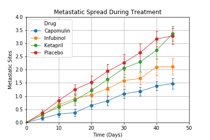

# Pymaceuticals - Data Analysis Using Matplotlib

This repository contains a .ipynb file analyzing data from a fictional pharmaceutical company.  The data was loaded into the jupyter notebook using the pandas Python library.  Pandas was also used to format the data into different dataframes to be used to create various data visualizations.  The following visualizations were made using Matplotlib to understand fictional cancer study data.

